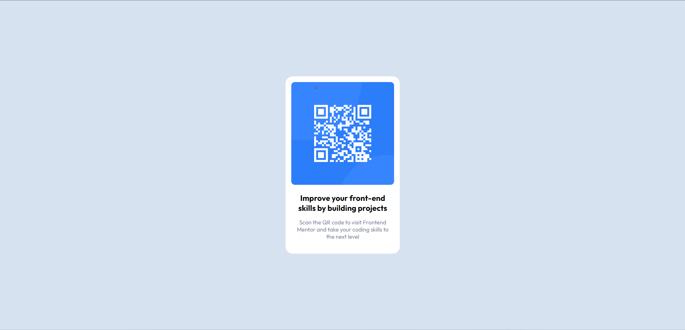

# Frontend Mentor - QR Code Component

This is a solution to the [QR Code Component](https://www.frontendmentor.io/challenges/qr-code-component-iux_sIO_H).

## Table of contents

- [Frontend Mentor - QR Code Component](#frontend-mentor---qr-code-component)
  - [Table of contents](#table-of-contents)
  - [Overview](#overview)
    - [Screenshot](#screenshot)
    - [Links](#links)
  - [My process](#my-process)
    - [Built with](#built-with)
  - [Author](#author)

## Overview

### Screenshot

### Links

- Solution URL: [Frontend Mentor](https://www.frontendmentor.io/solutions/qr-code-component-gG8dqSOoRQ)
- Live Site URL: [Github Pages](https://cozymeds.github.io/QR-Code-Component-Main/)

## My process

### Built with

- Semantic HTML5 markup
- CSS custom properties
- Flexbox
- Mobile-first workflow
- [Styled Components](https://styled-components.com/) - For styles

## Author

- Frontend Mentor - [@Erratic56](https://www.frontendmentor.io/profile/Erratic56)